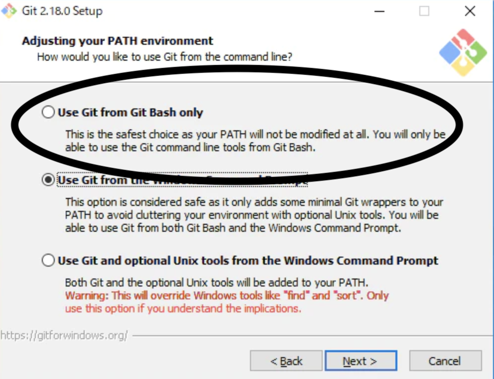

# Gitインストール方法

## 教材
[使用教材](https://hacknote.jp/archives/52900/)

## 進め方

上記記事の手順通りに作業を進めてください 
git bashを立ち上げ、黒い画面が表示されたら成功です。

## 参考
[いまさらGit for Windowsのインストール、GitHubに接続してみた。](https://qiita.com/manabu-watanabe/items/ecf1b434baf305adaa00)
こちらの記事はより詳しくインストール方法が記載されています。 
この記事を読んで、進めて頂いても構いません。 
下記に注意点と進め方を記載をしていますので、確認してから作業に移りましょう

**記事内の　ダウンロード ~ インストール後　までの項目を行いましょう**

**基本的にポップアップにでてくる画面はデフォルトのまま、【Next】を押してすすんでいきましょう。**

## デフォルトのエディタを設定(コミットコメントなどで使用します。)
こちらの項目に表示されるポップアップ画面もデフォルトのまま(何も設定を変えず)に進みます。

## Windowsの環境変数PATHへ追加する内容を設定

記事では二番目の【Use Git from the Windows Command Promt】が選択されていますが、 
こちらもデフォルトの設定のまま【Next】をおしましょう。

## 最後に
わからないことがあれば、slackやバーチャルスタディルームを活用し、お気軽に講師に質問してください。

## こちらの設定もやってみよう

実はVS Code上からでもコマンド操作は可能です。 
Vs Codeを開き,`ctrl + shift + @`を押すとVS Code下部に、コマンド操作画面が開かれます。 
デフォルトではコマンドプロンプト、もしくはPower shellが使用できる設定になっています。 
ここに先程インストールしたbashを表示できるように設定します。

### [VS Codeのターミナル設定](https://from-age35.com/1178.html)

上記URLをクリックし、【VSCodeにてターミナルの設定】を読んでトライしてみましょう。
