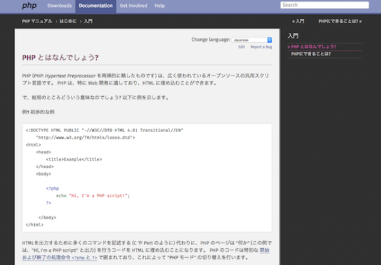

# PHPとは
PHP（PHP: Hypertext Preprocessor）は、動的なWebサイトの作成を目的とした、サーバーサイドで動作するプログラミング言語です。
クライアントからサーバへリクエストが送られた際、サーバがHTML内に記述されているPHPのプログラムの処理を実行し、処理結果をHTMLページにしてクライアントへ返します。 そのため、クライアント側ではPHPのプログラムを見ることはなく、処理結果だけ見ることができます。
シンプルな文法に加え多くの便利な機能を持ち、簡単なWebサイトから大規模なWebサイトまで幅広く利用されています。

PHPの大きな特徴として、 **HTMLに埋め込んで記述可能** な点が挙げられます。
PHPでは<?phpと?>で囲まれた部分を、PHPのプログラムコードとして解釈します。`<?php`と`?>`は、それぞれPHPの開始タグ／終了タグと呼ばれ、これらのタグで囲まれていない部分はそのまま出力されます。

# PHPの歴史
1995年6月、Rasmus Lerdorf（ラスマス・ラードフ）氏によって作成されたPHP1.0が公開されました。 当初PHPは現在のPHP: Hypertext Preprocessorの略ではなく、Personal Home Page Tools（PHP Tools）という名前でした。
1998年6月にPHP3.0が公開され、その時点ですでに多くのPHP利用者がおり、3.0の公開にあたって現在のPHP: Hypertext Preprocessorに改名されました。

2016年8月現在、PHPの最新バージョンは7.0になりますが、皆さんがXAMPPで使用するPHPのバージョンは5.6系かと思います。

PHPは公式マニュアルがバージョンごとに充実しており、今後プログラミングを学習していく際のリファレンスとして頻繁に使用することになるので、ブックマークしておきましょう。

公式マニュアル:https://www.php.net/manual/ja/index.php



また、今後PHPの学習を進めていく中で数々のエラーやバグと遭遇すると思います。 その際には、デバッグチェックシートを参照してください。

# PHPの基本ルール
PHPを扱っていく際、いくつかルールがあるので覚えておきましょう。

## PHPの実行環境
PHPはHTMLと違い、クライアント側で動作するのではなくサーバーサイドで動作する言語です。 そのため、ブラウザだけでなくPHPを動かすための環境（Webサーバー）が必要になります。
そのPHPを動かすための環境が、皆さんがこれから使用していくXAMPP環境になります。

PHPの動作を確認するためには、HTML／CSSを学習していた時のようにファイルをブラウザで直接開くのではなく、XAMPPやLAMP環境を通してファイルにアクセスする必要があります。
もしブラウザで単純にPHPファイルを開いてしまうと、PHPのコードが実行されず、ファイルの記述内容がそのままブラウザ上に表示されてしまいますので注意してください。

## ファイルの拡張子
PHPのコードが書いてあるファイルは、拡張子を必ず「.php」とする必要があります。

## PHPのコーディングスタイル
### PHPコード
PHPのコードを扱う場合、最初に`<?php`、最後に`?>`を書いてください。

```
<?php
  ここにPHPコードを記述
?>
```

### インデント
PHPのインデントは、半角スペース4つになります。

### コメントアウト
PHPでは、コメントアウトを表現するのに//とスラッシュをふたつ書きます。
```
<?php
// この行がコメント
?>
```
### 文末
PHPのコードには、処理の最後に必ずセミコロン「;」が必要です。

# PHPを動かしてみよう
XAMPPのhtdocsフォルダに「php_basic.php」というファイルを作成し、次のように記述してPHPのプログラムを実行してみましょう。

ブラウザに「Hello world!」という文字が表示されれば成功です。

- 実行するには、XAMPPを起動させておく必要があります。
- PHPファイルをブラウザで開くには、こちらからアクセスしてください。

```
php
<?php
  echo 'Hello world!';
?>
```

※文字列に日本語を使用すると文字化けする可能性があります。 HTMLと合わせて使用し、文字コードをutf-8にセットすることで解消されます。

```
<!DOCTYPE html>
<html lang="ja">
<head>
  <title>sample</title>
  <meta charset="utf-8">
</head>
<body>
  <?php
    echo 'こんにちは！';
  ?>
</body>
</html>

```

プログラミングでは、何らかの処理を書いてその処理が正しく実行されたかを確認するために、その結果を文字列として出力して確認することが多々あります。
PHPでは、文字列を出力するためにechoという命令文を使います。

別のサイトやPHPの入門本では、echoではなくprintを使用して文字を出力しているものもありますが、どちらでも出力結果は同じです。

STOでは、文字の出力はechoを使って進めていきます。

# データ型

プログラミングの世界には、 データ型 というものが存在します。
理由としては、コンピュータにデータを処理させる際、そのデータをどういった形で処理したいのか明言する必要があるためです。

例えば、「3」という数字で例えてみましょう。これは私達人間から見れば数字であり、記述されているので文字でもありますが、 コンピュータから見る場合は文字なのか数字なのかしっかり定義してあげないと処理ができません。
この「3」を数字として処理するのか、それとも文字として扱うのか……コンピュータにとって、単なる「3」ではその後の選択肢が多すぎるのです。

「3」を他の数字と足したり引いたりと計算したい場合は数字として定義し、ただブラウザに表示するための文字を作るのであれば文字として定義します。 これがデータ型と呼ばれるものです。
そして、PHPでは下記リストに上げる8つの型をサポートしています。


|種類|型名|
|整数型|integer|
|浮動小数点型|float,double|
|文字列型|string|
|論理型|boolean|
|配列型|array|
|オブジェクト型|object|
|Null型|null|
|リソース型|resourse|
